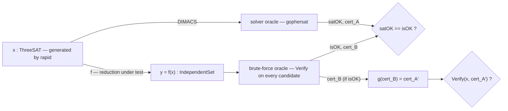

# 6. Pipeline Architecture

## 6.1 The components

The pipeline is the executable counterpart of all the preceding theory. Its pieces, and which theoretical notion each one corresponds to:

| Component | Role | Corresponds to |
|---|---|---|
| Typed instances | represent $x \in \Sigma^*$ for each problem (`ThreeSAT`, `IndependentSet`, `VertexCover`, `Clique`, `SubsetSum`) | the language $L$ ([1.1](01-decision-problems-p-np.md#11-decision-problems)) |
| Per-type verifier | `Verify(instance, certificate) → bool`, one per problem | the verifier $V$ ([1.3](01-decision-problems-p-np.md#13-the-class-np-definition-via-verifier-and-certificate)) |
| Reduction $f$ | a pure function `InstanceA → InstanceB` | the witness of $A \le_p B$ ([3.1](03-polynomial-many-one-reductions.md#31-definition)) |
| Certificate map $g$ | a pure function `CertificateB → CertificateA` | the constructive direction of the biconditional ([1.3](01-decision-problems-p-np.md#13-the-class-np-definition-via-verifier-and-certificate), [5.4](05-cook-levin-and-practice.md#54-every-reduction-as-a-constructive-mini-proof)) |
| SAT oracle | decides `ThreeSAT` for real, in practical time | the reference algorithm the chain is anchored to ([5.3](05-cook-levin-and-practice.md#53-the-practical-recipe--and-what-the-project-assumes-instead-of-proving)) |
| Brute-force oracle | decides every other problem by enumerating candidates and calling `Verify` | the "naive" algorithm implicit in the definition of NP ([1.3](01-decision-problems-p-np.md#13-the-class-np-definition-via-verifier-and-certificate)) |
| Instance generator | produces random `ThreeSAT` instances (property test) | the sampling that empirically corroborates the invariant ([5.4](05-cook-levin-and-practice.md#54-every-reduction-as-a-constructive-mini-proof)) |

Only `ThreeSAT` needs a generator and an *efficient* oracle: it is the only problem that appears as the source in every reduction of the chain ([5.3](05-cook-levin-and-practice.md#53-the-practical-recipe--and-what-the-project-assumes-instead-of-proving)), so it is the only one for which the project needs to handle instances of realistic size. Every other instance type in the pipeline is **always** born as the image of a reduction ($y = f(x)$) — it is never generated directly — and so stays as small as $x$ is.

## 6.2 Why two different oracles, not one

The choice to have a "real" oracle only for `ThreeSAT`, and a brute-force oracle for everything else, is not a shortcut: it is a direct consequence of the definition of NP given in [1.3](01-decision-problems-p-np.md#13-the-class-np-definition-via-verifier-and-certificate).

- For `ThreeSAT`, the project uses a real SAT solver (`gophersat`) because that is the task the project has stated from the very beginning — "verified end-to-end against a real SAT solver" — and it is also the only point in the pipeline where the oracle's efficiency actually matters, since it is the only instance type generated directly and therefore potentially not tiny.
- For every other problem (`IndependentSet`, `VertexCover`, ...), an oracle based on **exhaustive enumeration of candidate certificates, filtered by `Verify`**, is correct *by definition* — it is literally the "try every $y$ with $\|y\| \le p(\|x\|)$" algorithm that NP's certificate definition ([1.3](01-decision-problems-p-np.md#13-the-class-np-definition-via-verifier-and-certificate)) guarantees to be correct, even if not efficient. No second industrial-strength solver is needed: it is enough that the instance stays small, which is guaranteed by the previous point (6.1).

This asymmetry also makes it clearer what the project is actually testing when it runs a property test: it is **not** testing whether `gophersat` is correct (that is taken as given — it is a third-party library), and it is **not** testing whether the brute-force oracle is correct (it is, by construction, being the direct enumeration of the definition). It is testing $f$ and $g$ — the only code written by this project in this chain — using the two oracles as a fixed reference point, independent of both sides of the reduction.

## 6.3 Data flow for a single test case

A single case generated by the property test goes through four checks, not one:

1. **Construction**: $y = f(x)$ — no check here, just execution of the reduction.
2. **Double decision**: the SAT oracle decides $x$, the brute-force oracle decides $y$, independently of each other.
3. **Invariant $A(x) = B(f(x))$**: the two boolean decisions (`satOK`, `isOK`) must agree — this is the verification of $f$'s correctness as a map that preserves the yes/no answer ([Section 3.1](03-polynomial-many-one-reductions.md#31-definition)).
4. **Certificate**: if `isOK`, $g$ is applied to the certificate found by the brute-force oracle and the result is verified **directly on $x$**, with `ThreeSAT`'s own verifier — this is a check *independent* from the third: a bug in $g$ that produces a wrong certificate would not make the invariant in point 3 fail (that one only concerns yes/no), but it would make this check fail. The two checks catch different classes of bugs, which is why they are kept separate instead of being collapsed into a single assertion.

If a case fails either check, `rapid` (or `hedgehog`, depending on the language — the decision landed on Go, but the role is the same) automatically shrinks the instance to a minimal counterexample, so the $x$ that ends up in the failure report is already the smallest one that breaks the invariant.

## 6.4 The DIMACS boundary

The DIMACS CNF format is the **only** point of contact between the project's typed world and the external solver: serialization happens exclusively for `ThreeSAT` instances (the only type the solver needs to be able to read), in one direction only (instance → text), never having to deserialize CNF back into a data structure. It is also the most literal boundary of the "reduction as compilation" metaphor adopted from the start: every reduction $f$ is a compilation between the project's internal representations, while DIMACS emission is the only true "object code emission" toward an external tool.

## 6.5 Realization note in Go

The entire description above is language-independent (it was designed that way, even before deciding between Go and R). Its concrete realization, given that the choice landed on Go:

- every typed instance is a dedicated Go `struct` (see [Section 3](03-polynomial-many-one-reductions.md), `Clause3 [3]Literal` included);
- every reduction $f$ and every map $g$ is a free function with an explicit signature `func(A) B`;
- the SAT oracle is `gophersat`, called in-process; the brute-force oracle is a single generic function (Go generics) parameterized over the instance type and the certificate type, reused for every problem other than `ThreeSAT`;
- the generator and the test orchestration are a `rapid.Check` per reduction in the chain, following the scheme shown in 6.3.

## 6.6 Closing

With this section the report has completed the full circle announced at the start of the project: every reduction function in the code is a witness of $\le_p$ ([Section 3](03-polynomial-many-one-reductions.md)); every property test comparing the two oracles is the correctness condition of [Section 3.1](03-polynomial-many-one-reductions.md#31-definition) made executable; every map $g$ is the constructive direction of NP's certificate definition ([Section 1.3](01-decision-problems-p-np.md#13-the-class-np-definition-via-verifier-and-certificate)); and the entire chain rests, by transitivity ([Section 4.3](04-purpose-of-reductions.md#43-the-preorder-on-difficulty)), on a single fixed point that is cited but not re-proved — Cook–Levin ([Section 5](05-cook-levin-and-practice.md)). Theory and code remain two views of the same object, not two parallel projects.

---

| | | |
|:---|:---:|---:|
| [← Previous: 5. Cook–Levin and Practice](05-cook-levin-and-practice.md) | [README](../README.md) | |
