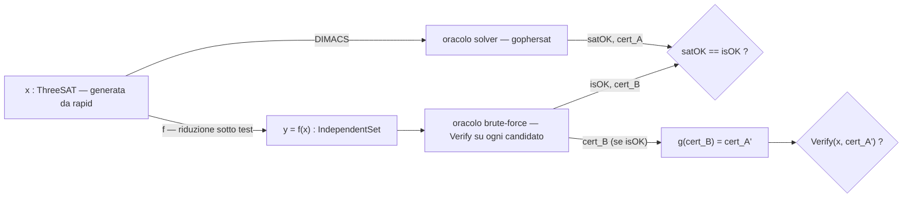

# KARP — Riduzioni tra problemi NP-completi: relazione teorica

## 1. Problemi di decisione, P e NP

### 1.1 Problemi di decisione

Un **problema di decisione** è formalizzato come un linguaggio `L ⊆ Σ*`: un sottoinsieme delle stringhe su un alfabeto finito. Un'**istanza** è una stringa `x`, e "risolvere" il problema su quell'istanza significa rispondere alla domanda `x ∈ L?` con sì o no.

Si lavora con problemi di decisione, e non direttamente con problemi di ricerca ("trovami una soluzione") o di ottimizzazione ("trovami la soluzione migliore"), per un motivo tecnico preciso: la decisione è la forma più semplice possibile del problema, e per i problemi trattati in questo progetto le tre forme sono equivalenti in difficoltà tramite un argomento di **auto-riducibilità** — se sai decidere in tempo polinomiale "esiste un independent set di taglia k?", puoi trovarne uno esplicito con un numero polinomiale di chiamate allo stesso decisore (fissi un vertice dentro o fuori, richiedi ricorsivamente, e la risposta sì/no a ogni passo ti guida). Va precisato: questa equivalenza non è un teorema generale che segue automaticamente dalla NP-completezza — è una proprietà (detta auto-riducibilità) dimostrata caso per caso, problema per problema, con un argomento costruttivo come quello appena visto; vale per tutti i problemi "naturali" usati qui, ma non è garantita per un generico linguaggio NP-completo costruito ad arte. Studiare la decisione resta comunque la forma canonica da cui partire.

### 1.2 La classe P

Un linguaggio `L` è in **P** se esiste un algoritmo deterministico che, per ogni istanza `x`, decide `x ∈ L` in un numero di passi limitato da `p(|x|)` per qualche polinomio fisso `p`.

Il grado del polinomio non conta ai fini della definizione — conta solo che esista un limite polinomiale, uniforme su tutte le istanze. Questo taglio è deliberatamente grossolano rispetto alla pratica (un algoritmo `O(n^100)` è "efficiente" secondo questa definizione ma inutilizzabile) ma è quello giusto per fare teoria, per una ragione di robustezza discussa nella sezione 2.

### 1.3 La classe NP: definizione tramite verificatore e certificato

La definizione operativamente più utile — ed è quella che questo progetto adotta come primaria — è:

> `L ∈ NP` se esiste un algoritmo deterministico `V` (il **verificatore**) e un polinomio `p` tali che, per ogni `x`:
> `x ∈ L` **se e solo se** esiste una stringa `y` (il **certificato**, o testimone) con `|y| ≤ p(|x|)` tale che `V(x, y)` accetta in tempo polinomiale in `|x|`.

In parole: appartenere a NP non significa "posso decidere velocemente", significa "se la risposta è sì, esiste una prova corta di quel fatto, e quella prova si controlla velocemente". La ricerca del certificato può essere arbitrariamente costosa; la sua *verifica*, no.

Esempi diretti sui problemi di questo progetto:

- **3-SAT**: certificato = un assegnamento di verità alle variabili. Verifica = valutare ogni clausola, tempo lineare nella dimensione della formula.
- **Independent Set**: certificato = l'insieme di vertici stesso. Verifica = controllare che non ci siano archi tra coppie di vertici scelti e che la taglia sia `≥ k`, tempo polinomiale nel numero di vertici scelti.
- **Subset Sum**: certificato = il sottoinsieme. Verifica = sommarne gli elementi e confrontare col target.

Nota la forma comune: in tutti e tre i casi il certificato *è* più o meno l'oggetto che stai cercando, non un artefatto ausiliario. Questo non è un caso — è la ragione per cui, nel progetto, la funzione di ricostruzione `g` (che riporta un certificato del problema ridotto a un certificato del problema originale) è una parte naturale della riduzione e non un'aggiunta artificiale: sta semplicemente rendendo esplicita la struttura di certificato di ciascun problema.

### 1.4 Definizione equivalente: macchina di Turing non deterministica

La definizione più comune nei testi è alternativa ma equivalente: `L ∈ NP` se esiste una macchina di Turing non deterministica che decide `L` in tempo polinomiale (cioè: per ogni istanza in `L`, *esiste* un cammino computazionale accettante di lunghezza polinomiale).

L'equivalenza con la definizione a verificatore si vede in entrambe le direzioni con un argomento diretto: le scelte non deterministiche lungo un cammino accettante *sono* il certificato (basta scriverle in sequenza); viceversa un verificatore deterministico `V(x, y)` si simula con una macchina non deterministica che prima "indovina" `y` non deterministicamente bit a bit, poi esegue `V` deterministicamente.

Le due definizioni sono intercambiabili sul piano teorico. Nella relazione e nel codice si userà quasi sempre quella a certificato, perché è quella operativamente rilevante: un decisore SAT reale non simula non-determinismo, produce un certificato (l'assegnamento) quando risponde SAT.

### 1.5 P ⊆ NP, e cosa resta aperto

`P ⊆ NP` è immediato dalla definizione a verificatore: se `L ∈ P`, il verificatore può ignorare il certificato del tutto e decidere `x ∈ L` da solo in tempo polinomiale (equivalentemente: certificato vuoto, `V(x, y) := "risolvi x direttamente"`).

Se l'inclusione sia stretta (`P ≠ NP`) è il problema aperto più noto dell'informatica teorica, e questo progetto non tenta di dire nulla a riguardo. È utile però essere precisi su cosa la relazione *assume* implicitamente: si lavora nel presupposto (universalmente creduto, mai dimostrato) che `P ≠ NP`, perché è quel presupposto a rendere interessante il fatto che un problema sia NP-completo — se un giorno risultasse `P = NP`, ogni riduzione qui costruita rimarrebbe corretta, ma la nozione di "difficoltà intrinseca" che le motiva collasserebbe.

### 1.6 Un'asimmetria da tenere a mente

La definizione di NP è **asimmetrica**: parla di certificati corti per le istanze sì, e non dice nulla su come riconoscere velocemente le istanze no. Non è ovvio (ed è a sua volta un problema aperto collegato a P vs NP) che anche le istanze no abbiano certificati corti della propria negatività — questa proprietà definisce la classe **co-NP**, e `NP = co-NP` non è noto.

Questa asimmetria non è un dettaglio erudito: riemerge esattamente quando, nella sezione sulle riduzioni, si dovrà argomentare la correttezza di una riduzione `f` nelle due direzioni `x ∈ A ⟹ f(x) ∈ B` e `x ∉ A ⟹ f(x) ∉ B` — la seconda direzione (la preservazione della *non* esistenza di soluzione) è tipicamente quella che richiede l'argomento matematico vero, perché non c'è un certificato da esibire per dimostrarla per un singolo esempio.

---

## 2. A cosa servono le classi di complessità

### 2.1 Classificano il problema, non un algoritmo

Un enunciato come "il Vertex Cover è NP-completo" non è un'affermazione su un algoritmo specifico — è un'affermazione sull'intero problema: nessun algoritmo, tra tutti quelli possibili, lo risolve in tempo polinomiale nel caso peggiore, a meno che `P = NP`. È una distinzione importante: sapere che un problema sta in una classe dice qualcosa sulla sua struttura intrinseca, indipendente da quanto sei bravo a scrivere codice.

Questo è anche il motivo per cui una dimostrazione di appartenenza a NP (via certificato, sezione 1.3) e una dimostrazione di NP-completezza (via riduzione, sezione 3) sono così diverse nella forma: la prima esibisce un oggetto concreto (l'algoritmo verificatore); la seconda è un argomento *per assurdo indiretto* — mostra che un ipotetico algoritmo veloce per il problema ne implicherebbe uno per ogni problema in NP, il che è ritenuto impossibile.

### 2.2 Sono robuste rispetto al modello di calcolo

La soglia "tempo polinomiale" non è arbitraria: è la soglia più grossolana che resta stabile cambiando modello di calcolo ragionevole. Macchina di Turing a un nastro, a più nastri, RAM machine con operazioni aritmetiche a costo unitario — questi modelli si simulano l'un l'altro con un overhead **polinomiale** (tipicamente anche solo quadratico o meno). Quindi "esiste un algoritmo polinomiale" è una proprietà del *problema*, non del modello scelto per formalizzarlo: se è vera in un modello, è vera in tutti.

Questa è la stessa idea della tesi di Church-Turing, applicata non alla calcolabilità ma all'efficienza: non ci interessa l'esponente esatto (che dipende dal modello e dai dettagli implementativi), ci interessa la soglia qualitativa polinomiale/non-polinomiale perché è quella l'unica a essere invariante. È anche per questo che la definizione di P non specifica il grado del polinomio: specificarlo la renderebbe dipendente dal modello, e quindi teoricamente meno interessante — anche se, come già notato, meno utile a distinguere "efficiente" da "inefficiente" nella pratica reale.

### 2.3 Danno un vocabolario comune a domini diversi

Il valore pratico più immediato: le classi di complessità permettono di confrontare problemi che, in superficie, non hanno nulla in comune. 3-SAT è un problema di logica proposizionale; Independent Set è un problema di teoria dei grafi; Subset Sum è un problema aritmetico. Non esiste un modo ovvio per dire "questi tre problemi sono ugualmente difficili" restando dentro il linguaggio di ciascun dominio — la nozione di classe di complessità (e, a valle, di riduzione) è precisamente il ponte che lo rende un'affermazione precisa e dimostrabile. È esattamente il ponte che questo progetto attraversa esplicitamente nel codice: la stessa "difficoltà" si manifesta come formula, come grafo, e come insieme di numeri.

### 2.4 Trasferiscono risultati negativi, e orientano la pratica

Dire "non ho trovato un algoritmo polinomiale per B" è un'affermazione debole — potrebbe voler dire solo che non ci hai provato abbastanza. Dire "B è NP-completo" è un'affermazione forte: significa che *nessuno*, in cinquant'anni di ricerca su migliaia di problemi NP-completi collegati fra loro, ha trovato un algoritmo polinomiale per *nessuno* di essi — e trovarne uno per B risolverebbe automaticamente tutti gli altri. Questo è il senso in cui le classi "servono": non tanto a risolvere il problema, quanto a dare una risposta rigorosa e trasferibile alla domanda "perché è difficile, e quanto ci si può fidare del fatto che resti difficile".

Sul piano pratico, questo risultato negativo è anche una guida: una volta che un problema è noto NP-completo, la domanda giusta smette di essere "come trovo l'algoritmo polinomiale esatto" e diventa "quale compromesso accetto" — approssimazione, euristiche, restrizione a casi speciali, o algoritmi esponenziali nel caso peggiore ma efficaci in pratica. I SAT solver moderni (l'oracolo usato in questo stesso progetto) sono l'esempio concreto di quest'ultima strada: NP-completo nel caso peggiore non vuol dire "inutilizzabile", vuol dire "nessuna garanzia di caso peggiore polinomiale" — e c'è molto spazio, sfruttato industrialmente, tra i due.

### 2.5 Nota di raccordo verso le riduzioni

Le classi P e NP, come definite qui, parlano di calcolo diretto su un singolo problema: un algoritmo, o un verificatore, per *quel* linguaggio. Da sole non dicono ancora nulla su come due problemi si confrontano tra loro. Lo strumento che costruisce quel confronto — e che dà struttura interna a NP, individuando al suo interno i problemi "più difficili di tutti gli altri" — è la riduzione polinomiale, oggetto della prossima sezione.

---

## 3. Riduzioni many-one polinomiali

### 3.1 Definizione

Dati due problemi di decisione `A, B ⊆ Σ*`, una **riduzione many-one polinomiale** (o **riduzione di Karp**) da `A` a `B` è una funzione `f: Σ* → Σ*` tale che:

1. `f` è **totale e computabile in tempo polinomiale** (esiste un algoritmo deterministico che calcola `f(x)` in tempo `≤ p(|x|)` per ogni `x`, per qualche polinomio fisso `p`);
2. per ogni istanza `x`: `x ∈ A ⟺ f(x) ∈ B`.

Si scrive `A ≤p B` ("`A` si riduce a `B`"), e si legge `f` come un **testimone** di quella relazione: la sua sola esistenza è la dimostrazione che `A ≤p B` vale.

Il nome "many-one" descrive la forma della funzione: `f` può mandare istanze diverse di `A` sulla stessa istanza di `B` (non deve essere iniettiva), ma ogni istanza di `A` viene trasformata in **esattamente un'unica** istanza di `B` — non è concesso costruire più istanze di `B`, interrogarle, e combinare le risposte. È esattamente il senso di "reduction as compilation" del progetto: `f` è una funzione pura, `A`-istanza dentro, `B`-istanza fuori, senza stato intermedio né logica di combinazione.

### 3.2 Distinzione da Turing/Cook

La definizione precedente è un caso particolare, più restrittivo, di una nozione più generale: la **riduzione di Turing** (o di Cook). `A ≤T B` significa che esiste un algoritmo deterministico polinomiale per `A` che ha accesso a un **oracolo** per `B` — puoi interrogare l'oracolo un numero polinomiale di volte, in modo **adattivo** (la query `i+1`-esima può dipendere dalla risposta alla query `i`-esima), e puoi fare quello che vuoi con le risposte prima di produrre il verdetto finale su `A` (incluso negarle, combinarle con AND/OR, ecc.).

Ogni riduzione many-one è anche una riduzione di Turing (basta fare una sola query, con `f(x)`, e restituirne la risposta invariata), ma non vale il viceversa: una riduzione di Turing può fare cose che una many-one non può, per esempio decidere `A` interrogando l'oracolo sia su `f(x)` sia sul suo "complemento" e confrontando le due risposte.

Per questo progetto serve — ed è sufficiente — solo la nozione many-one di Karp, per una ragione precisa che va oltre la semplice economia di mezzi: **una singola chiamata, senza post-elaborazione della risposta, è esattamente la struttura che rende possibile ricostruire un certificato**. Se `f(x) ∈ B` con certificato `y_B`, e la trasformazione `f` è nota esplicitamente, spesso si può leggere `y_B` "all'indietro" attraverso la struttura di `f` e ottenere un certificato `y_A` per `x ∈ A` — è precisamente il ruolo della funzione `g` introdotta nel codice del progetto (`g: certificato_B → certificato_A`). Con una riduzione di Turing generica, con più chiamate adattive e logica di combinazione arbitraria, questa ricostruzione non ha in generale una forma pulita: non c'è un'unica istanza di `B` da cui "leggere all'indietro" la risposta.

Nella letteratura, quando ci si riferisce genericamente a "NP-completezza" senza specificare il tipo di riduzione, si intende quasi sempre quella many-one — è la nozione usata da Karp nel suo articolo del 1972 sui 21 problemi NP-completi, ed è quella adottata qui.

---

## 4. A cosa servono le riduzioni

### 4.1 Trasferimento di difficoltà: la direzione "facile"

Se `A ≤p B` tramite `f`, e `B ∈ P`, allora `A ∈ P`. La dimostrazione è la composizione diretta dei due algoritmi: per decidere `x ∈ A`, si calcola `y = f(x)` (tempo polinomiale per definizione di riduzione), poi si esegue su `y` l'algoritmo polinomiale per `B` (tempo polinomiale in `|y|`).

Il punto che rende l'argomento non banale è la composizione delle taglie: `f` gira in tempo polinomiale, quindi la sua *uscita* `y` ha lunghezza polinomiale in `|x|` (non può scrivere più caratteri di quanti passi di calcolo compie). Perciò il secondo algoritmo, polinomiale in `|y|`, è a sua volta polinomiale in `|x|` — la composizione di due polinomi è un polinomio. È precisamente per questa ragione che nella definizione di riduzione (sezione 3.1) si richiede che `f` sia calcolabile in tempo polinomiale, e non semplicemente calcolabile: una `f` computabile ma esponenziale trasferirebbe comunque la relazione `x ∈ A ⟺ f(x) ∈ B`, ma romperebbe la catena di efficienza, e con essa l'unico motivo per cui la riduzione è interessante.

### 4.2 Trasferimento di difficoltà: la direzione "difficile" (per contrapposizione)

Il contenuto pratico sta nella contronominale dell'affermazione precedente: se `A ≤p B` e `A ∉ P`, allora `B ∉ P`. (Se fosse `B ∈ P`, per 4.1 sarebbe anche `A ∈ P`, contraddizione.)

Questa è la direzione che si usa davvero. Per dimostrare che un problema `B` appena incontrato è (presumibilmente) difficile, **non** si cerca di ridurre `B` a qualcos'altro — si esibisce una riduzione **da** un problema `A` già noto per essere difficile **verso** `B` (`A ≤p B`). È la ragione, spesso fonte di confusione quando si incontra l'argomento per la prima volta, per cui le riduzioni di questo progetto vanno tutte "in avanti" a partire da 3-SAT: 3-SAT è il problema di riferimento noto difficile (sezione 5), e ogni riduzione `3-SAT ≤p X` è un modo per dire "`X` eredita la difficoltà di 3-SAT", non il contrario.

### 4.3 L'ordine (pre-)parziale sulla difficoltà

`≤p` è **riflessiva** (la funzione identità è una riduzione banale di `A` a se stesso) e **transitiva**: se `A ≤p B` tramite `f` e `B ≤p C` tramite `f'`, allora `A ≤p C` tramite la composizione `f' ∘ f` — che è ancora polinomiale, per lo stesso argomento di composizione delle taglie visto in 4.1. Queste due proprietà rendono `≤p` un **preordine** sull'insieme dei problemi di decisione: non un ordine totale (non tutti i problemi sono confrontabili), e nemmeno un ordine parziale in senso stretto (`A ≤p B` e `B ≤p A` non implicano `A = B`, solo che i due problemi hanno la stessa difficoltà "a meno di riduzione poli­nomiale").

Una nota che aiuta a inquadrare dove sta l'interesse di questa relazione: **tutti** i problemi non banali di `P` (cioè diversi dal linguaggio vuoto e da quello universale, due casi degeneri che vanno esclusi per una ragione tecnica legata a come si costruisce la riduzione costante) si riducono gli uni agli altri in tempo polinomiale — quindi `≤p`, ristretta a `P`, colassa in un'unica classe indistinguibile. `≤p` diventa uno strumento discriminante solo quando si guarda a problemi che si sospetta stiano *fuori* da `P`: è lì che l'ordine smette di essere banale e comincia a stratificare i problemi per difficoltà relativa.

### 4.4 Completezza

Un problema `B` è **NP-completo** se valgono entrambe:

1. `B ∈ NP`;
2. per **ogni** `A ∈ NP`, `A ≤p B`.

Un problema NP-completo è quindi, per costruzione, il più difficile possibile dentro NP rispetto a `≤p`: tutto il resto della classe si riduce a lui. Combinando questo con 4.2: se anche un solo problema NP-completo risultasse essere in `P`, allora *ogni* problema di NP lo sarebbe (basta comporre la sua riduzione verso `B` con l'algoritmo polinomiale per `B`) — cioè `P = NP`. È questo il peso reale dell'affermazione "`B` è NP-completo": non è solo "è difficile", è "è difficile esattamente quanto lo è il problema più difficile dell'intera classe NP, qualunque esso sia".

La definizione, presa alla lettera, è però inutilizzabile come strumento dimostrativo diretto: mostrare `A ≤p B` per *ogni* `A ∈ NP` — un insieme infinito di problemi, in generale nemmeno enumerabile esplicitamente — non è qualcosa che si possa fare a mano problema per problema. La via d'uscita è la transitività vista in 4.3: se si conosce **un solo** problema `A₀` già dimostrato NP-completo, e si esibisce `A₀ ≤p B`, allora per ogni `A ∈ NP` si ha `A ≤p A₀ ≤p B` per transitività — cioè la singola riduzione `A₀ ≤p B` basta a ereditare *tutte* le infinite riduzioni richieste dalla definizione.

Questo è esattamente il motivo per cui questo progetto può limitarsi a costruire una **catena** di riduzioni (3-SAT → Independent Set → Vertex Cover → …) invece di ripartire ogni volta dalla definizione: ogni nuovo anello della catena richiede una sola riduzione dall'anello precedente, e la NP-completezza si propaga per transitività lungo tutta la catena. Resta un solo punto di partenza da giustificare fuori da questo meccanismo — il primo anello, quello che rende 3-SAT stesso NP-completo senza poter appoggiarsi a nessun problema precedente. È il contenuto del teorema di Cook–Levin, oggetto della prossima sezione.

---

## 5. Come si usano in pratica: Cook–Levin come radice, poi tutto per riduzione

### 5.1 Il teorema di Cook–Levin

La sezione 4.4 ha lasciato un problema aperto: la definizione di NP-completezza richiede una riduzione da *ogni* problema di NP, un requisito che nessuna dimostrazione può soddisfare direttamente problema per problema — e la transitività lo rende praticabile solo se **esiste già** almeno un problema NP-completo noto da cui partire. Il teorema di Cook–Levin (1971, indipendentemente Levin nello stesso periodo) è esattamente questo punto di partenza: dimostra che **SAT** (soddisfacibilità di formule booleane, in generale non necessariamente in forma normale congiuntiva a priori) è NP-completo, ed è l'unico risultato in questa storia dimostrato *dalla definizione pura*, senza appoggiarsi a nessuna riduzione precedente.

`SAT ∈ NP` è la parte facile (sezione 1.3: certificato = assegnamento, verifica = valutazione della formula, tempo lineare). La parte sostanziale è mostrare che **ogni** `L ∈ NP` soddisfa `L ≤p SAT`. L'idea, a un livello che ne rende visibile la struttura senza sviluppare la costruzione fino in fondo (è un progetto a sé, deliberatamente fuori dallo scope di questo — si veda la nota di scope in 5.3):

- Per definizione (sezione 1.3), `L ∈ NP` significa che esiste un verificatore `V` polinomiale e un polinomio `p` tali che `x ∈ L ⟺ ∃y, |y| ≤ p(|x|), V(x,y)` accetta. Il verificatore `V` è, in fondo, un programma — formalizzabile come una macchina di Turing che gira in un tempo `q(|x|)` polinomiale noto.
- Si costruisce una formula booleana `φ_x` che descrive l'intera esecuzione di `V` su input `x` e su un certificato `y` **non ancora fissato** (le variabili booleane di `φ_x` codificano, cella per cella e istante per istante, cosa c'è scritto sul nastro di `V` durante il calcolo — la cosiddetta *tabella di calcolo*, una griglia tempo × spazio di dimensione polinomiale). Le clausole di `φ_x` impongono tre cose: la configurazione iniziale codifica correttamente `x` (le celle per `y` sono libere — sono loro il grado di libertà della formula), ogni transizione rispetta le regole di `V` (vincoli **locali**, perché il valore di una cella al passo `t+1` dipende solo da un intorno ristretto al passo `t`), e si raggiunge uno stato accettante.
- Il punto chiave: `φ_x` è soddisfacibile se e solo se esiste un modo di riempire le celle libere (cioè un certificato `y`) che fa accettare `V` — cioè se e solo se `x ∈ L`. E la costruzione di `φ_x` a partire da `x` richiede tempo polinomiale, perché la tabella ha dimensioni polinomiali (`q(|x|)` righe) e ogni singola clausola è locale, quindi di dimensione costante.

Il risultato — `f(x) = φ_x` — è a tutti gli effetti una riduzione many-one polinomiale nel senso della sezione 3, con `A = L` e `B = SAT`. La differenza rispetto a ogni altra riduzione di questo progetto è **cosa** viene ridotto: non un problema combinatorio concreto verso un altro, ma l'*intera nozione di calcolo verificabile* (qualunque `L ∈ NP`, tramite il suo verificatore generico `V`) verso una singola struttura sintattica (una formula proposizionale). È l'unico ponte fra il mondo definitorio (verificatori, macchine di Turing) e il mondo combinatorio (clausole, grafi, insiemi) in cui vivono tutte le riduzioni successive — compresa quella usata come base di questo progetto.

### 5.2 Da SAT a 3-SAT

Cook–Levin, nella forma classica, produce SAT generico — formule con clausole di larghezza arbitraria. Il problema-radice scelto per questo progetto è **3-SAT** (clausole di larghezza esattamente 3), che richiede un passo aggiuntivo — ma di natura completamente diversa dal precedente: `SAT ≤p 3-SAT` si dimostra con una trasformazione puramente **sintattica**, senza toccare alcuna semantica di calcolo. Ogni clausola larga si spezza in una catena di clausole a 3 letterali introducendo variabili ausiliarie (`(l₁ ∨ l₂ ∨ l₃ ∨ l₄)` diventa `(l₁ ∨ l₂ ∨ z) ∧ (¬z ∨ l₃ ∨ l₄)`, e così via per clausole più lunghe), e le clausole troppo corte si riempiono duplicando un letterale. La trasformazione preserva la soddisfacibilità clausola per clausola ed è evidentemente polinomiale.

Vale la pena notare esplicitamente il contrasto: `SAT ≤p 3-SAT` è meccanica, quasi amministrativa — normalizza una forma sintattica in un'altra. `Cook–Levin` (`L ≤p SAT` per ogni `L ∈ NP`) è l'unica riduzione dell'intera catena che *crea* difficoltà dal nulla, nel senso che compila un intero modello di calcolo in struttura combinatoria. Tutte le riduzioni successive di questo progetto (sezione 6) assomigliano più alla seconda categoria che alla prima nello spirito — spostano difficoltà già esistente da una struttura combinatoria a un'altra, senza mai dover "inventare" difficoltà ex novo — ma questo richiede comunque intuizione strutturale specifica del dominio, a differenza della trasformazione puramente sintattica appena vista.

### 5.3 La ricetta pratica — e cosa il progetto assume invece di dimostrare

Messi insieme, Cook–Levin e `SAT ≤p 3-SAT` fissano un singolo fatto ancorante: **3-SAT è NP-completo**. Da qui in avanti, ogni nuova dimostrazione di NP-completezza segue sempre la stessa ricetta a due passi (rispecchia esattamente la definizione in 4.4):

1. mostrare che il nuovo problema `B` è in NP (esibire verificatore/certificato — quasi sempre il passo facile, sezione 1.3);
2. esibire **una sola** riduzione `A₀ ≤p B` da un problema `A₀` **già** noto NP-completo (mai dalla definizione pura) — per transitività (4.3), questo basta.

In pratica, nessuno dopo Cook e Levin ha mai più dovuto ripetere il passo 2 nella sua forma generale ("riduci da ogni `L ∈ NP`"): si sceglie come `A₀` il problema già noto la cui struttura assomiglia di più a quella del nuovo target — è per questo che esistono "famiglie" riconoscibili di riduzioni (problemi su grafi che si riducono ad altri problemi su grafi, problemi numerici che codificano bit di una formula, ecc.), non una collezione arbitraria e scollegata.

**Nota di scope, esplicita**: questo progetto **cita** il teorema di Cook–Levin come fatto stabilito (sezione 5.1 ne descrive la struttura, non lo implementa) e **assume** che 3-SAT sia NP-completo come punto di partenza — non lo dimostra costruttivamente in codice. Costruire il compilatore macchina di Turing → CNF descritto in 5.1 è un progetto a parte (una possibile estensione futura, non una lacuna di questo). Ciò che il progetto *fa* concretamente è tutto ciò che viene dopo l'ancoraggio: la catena di riduzioni `3-SAT ≤p Independent Set ≤p Vertex Cover` (con Clique quasi gratuita per complemento) più il ramo `3-SAT ≤p Subset Sum`, ciascuna verificata end-to-end contro un solver SAT reale usato come oracolo di verità per le istanze di 3-SAT.

### 5.4 Ogni riduzione come mini-dimostrazione costruttiva

Con l'ancoraggio a 3-SAT stabilito, ogni funzione di riduzione `f` scritta nel codice di questo progetto è, letteralmente, il testimone concreto di un passo della ricetta in 5.3: non un esercizio isolato, ma un anello che eredita — per transitività — la NP-completezza di tutta la catena costruita fino a quel punto.

Va però mantenuta la distinzione, già anticipata in 1.6, fra cosa la matematica garantisce e cosa il codice verifica empiricamente:

- la direzione costruttiva (`x ∈ A ⟹ f(x) ∈ B`, con certificato) è quella che il progetto rende eseguibile fino in fondo: la funzione `g` produce un certificato concreto per `B`, e quel certificato si verifica direttamente (sezione 1.3);
- la direzione "nessuna soluzione va persa" (`x ∉ A ⟹ f(x) ∉ B`) è un'affermazione universale su *tutte* le istanze, e resta una dimostrazione matematica scritta a parte per ciascuna riduzione — il property test contro l'oracolo SAT (sezione 6) la **corrobora empiricamente su istanze campionate**, non la sostituisce.

Questa distinzione — dimostrazione scritta per l'universale, verifica eseguibile per il campione — è il filo che lega la teoria di questa relazione all'architettura del codice, oggetto della sezione finale.

---

## 6. Architettura della pipeline

### 6.1 I componenti

La pipeline è la controparte eseguibile di tutta la teoria precedente. I suoi pezzi, e a quale nozione teorica corrisponde ciascuno:

| Componente | Ruolo | Corrisponde a |
|---|---|---|
| Istanze tipizzate | rappresentano `x ∈ Σ*` per ciascun problema (`ThreeSAT`, `IndependentSet`, `VertexCover`, `Clique`, `SubsetSum`) | il linguaggio `L` (1.1) |
| Verificatore per tipo | `Verify(istanza, certificato) → bool`, uno per problema | il verificatore `V` (1.3) |
| Riduzione `f` | funzione pura `IstanzaA → IstanzaB` | il testimone di `A ≤p B` (3.1) |
| Mappa del certificato `g` | funzione pura `CertificatoB → CertificatoA` | la direzione costruttiva del biconditional (1.3, 5.4) |
| Oracolo SAT | decide `ThreeSAT` per davvero, in tempo pratico | l'algoritmo di riferimento su cui si ancora la catena (5.3) |
| Oracolo brute-force | decide gli altri problemi enumerando candidati e chiamando `Verify` | l'algoritmo "banale" implicito nella definizione di NP (1.3) |
| Generatore di istanze | produce `ThreeSAT` casuali (property test) | il campionamento su cui si corrobora empiricamente l'invariante (5.4) |

Solo `ThreeSAT` ha bisogno di un generatore e di un oracolo *efficiente*: è l'unico problema che compare come sorgente in ogni riduzione della catena (5.3), quindi è l'unico per cui il progetto ha bisogno di gestire istanze di dimensione realistica. Ogni altro tipo di istanza nella pipeline nasce **sempre** come immagine di una riduzione (`y = f(x)`) — non viene mai generata direttamente — e quindi resta piccola quanto lo è `x`.

### 6.2 Perché due oracoli diversi, e non uno solo

La scelta di avere un oracolo "vero" solo per `ThreeSAT` e un oracolo brute-force per tutto il resto non è una scorciatoia: è la conseguenza diretta della definizione di NP data in 1.3.

- Per `ThreeSAT`, il progetto usa un solver SAT reale (`gophersat`) perché è quello il compito dichiarato del progetto fin dall'inizio — "verificato end-to-end con un SAT solver reale" — ed è anche l'unico punto della pipeline dove l'efficienza dell'oracolo conta davvero, dato che è l'unico tipo di istanza generato direttamente e quindi potenzialmente non piccolissimo.
- Per ogni altro problema (`IndependentSet`, `VertexCover`, ...), un oracolo per **enumerazione esaustiva di certificati candidati, filtrati da `Verify`**, è corretto *per definizione* — è letteralmente l'algoritmo "prova tutti gli `y` con `|y| ≤ p(|x|)`" che la definizione a certificato di NP (1.3) garantisce essere corretto, anche se non efficiente. Non serve un secondo solver industriale: basta che l'istanza resti piccola, il che è garantito dal punto precedente (6.1).

Questa asimmetria rende anche più nitido cosa il progetto sta davvero mettendo alla prova quando esegue un property test: **non** sta testando se `gophersat` è corretto (è dato per buono, è una libreria di terze parti), e **non** sta testando se l'oracolo brute-force è corretto (lo è per costruzione, essendo l'enumerazione diretta della definizione). Sta testando `f` e `g` — l'unico codice scritto nel progetto in questa catena — usando i due oracoli come metro di paragone fisso e indipendente da entrambi i lati della riduzione.

### 6.3 Flusso dei dati in un singolo caso di test

Un singolo caso generato dal property test attraversa quattro controlli, non uno:

1. **Costruzione**: `y = f(x)` — nessun controllo qui, è solo esecuzione della riduzione.
2. **Doppia decisione**: l'oracolo SAT decide `x`, l'oracolo brute-force decide `y`, indipendentemente l'uno dall'altro.
3. **Invariante `A(x) = B(f(x))`**: le due decisioni booleane (`satOK`, `isOK`) devono coincidere — questa è la verifica della correttezza di `f` come mappa che preserva la risposta sì/no (sezione 3.1).
4. **Certificato**: se `isOK`, si applica `g` al certificato trovato dall'oracolo brute-force e si verifica il risultato **direttamente su `x`**, con il verificatore di `ThreeSAT` — questo è un controllo *indipendente* dal terzo: un bug in `g` che produce un certificato sbagliato non farebbe fallire l'invariante al punto 3 (quello riguarda solo il sì/no), ma farebbe fallire questo controllo. I due controlli catturano classi di bug diverse, ed è per questo che restano separati invece di essere collassati in un unico assert.

Se un caso fallisce uno dei due controlli, `rapid` (o `hedgehog`, a seconda del linguaggio — decisione presa in favore di Go, ma il ruolo è lo stesso) restringe automaticamente l'istanza al controesempio minimo, così l'istanza `x` che finisce nel report di errore è già la più piccola che rompe l'invariante.

### 6.4 Confine DIMACS

Il formato DIMACS CNF è il **solo** punto di contatto fra il mondo tipizzato del progetto e il solver esterno: la serializzazione avviene esclusivamente per istanze `ThreeSAT` (l'unico tipo che il solver deve poter leggere), in una direzione sola (istanza → testo), senza mai dover deserializzare CNF all'indietro in una struttura dati. È anche il confine più letterale della metafora "reduction as compilation" adottata fin dall'inizio: ogni riduzione `f` è una compilazione fra rappresentazioni interne del progetto, mentre l'emissione DIMACS è l'unica vera "emissione di codice oggetto" verso uno strumento esterno.

### 6.5 Nota di realizzazione in Go

L'intera descrizione precedente è indipendente dal linguaggio scelto (era stata pensata così, prima ancora di decidere fra Go e R). La sua realizzazione concreta, dato che la scelta è caduta su Go:

- ogni istanza tipizzata è uno `struct` Go dedicato (sezione precedente, `Clause3 [3]Literal` incluso);
- ogni riduzione `f` e ogni mappa `g` è una funzione libera con firma esplicita `func(A) B`;
- l'oracolo SAT è `gophersat`, chiamato in-process; l'oracolo brute-force è una singola funzione generica (Go generics) parametrizzata sul tipo di istanza e sul tipo di certificato, riusata per tutti i problemi diversi da `ThreeSAT`;
- il generatore e l'orchestrazione del test sono un `rapid.Check` per ciascuna riduzione della catena, secondo lo schema mostrato in 6.3.

### 6.6 Chiusura

Con questa sezione la relazione ha percorso l'intero cerchio annunciato all'inizio del progetto: ogni funzione di riduzione nel codice è un testimone di `≤p` (sezione 3); ogni property test che confronta i due oracoli è la condizione di correttezza della sezione 3.1 resa eseguibile; ogni mappa `g` è la direzione costruttiva della definizione di NP a certificato (sezione 1.3); e l'intera catena poggia, per transitività (sezione 4.3), su un singolo punto fisso citato ma non ridimostrato — Cook–Levin (sezione 5). Teoria e codice restano due viste dello stesso oggetto, non due progetti paralleli.
